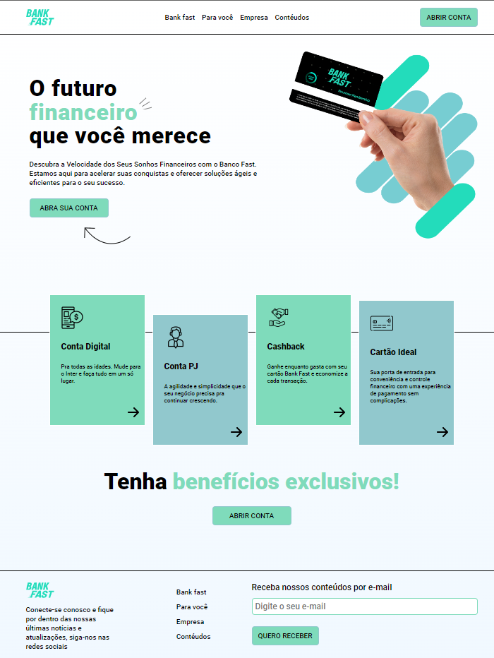

<h1 align="center"> Página inicial do FastBank </h1>

Projeto feito com intuito de treinar alguns conhecimentos entre HTML, CSS e MOBILEFIRST.  

  <a href="#-tecnologias">Tecnologias</a>&nbsp;&nbsp;&nbsp;|&nbsp;&nbsp;&nbsp;
  <a href="#-projeto">Projeto</a>&nbsp;&nbsp;&nbsp;|&nbsp;&nbsp;&nbsp;
  <a href="#memo-licença">Licença</a>

 

  

## 🚀 Tecnologias

Esse projeto foi desenvolvido com as seguintes tecnologias:

- HTML e CSS
- Git e Github
- Figma: https://www.figma.com/file/76GJ4uK7PyKeAo6dcpVyjA/Tom's-Jazz-School?node-id=0%3A1

## 💻 Projeto

O projeto foi apenas uma adptação de um outro projeto da escola de programação one bitcode o layout foi alterado para um pequeno exbosso de uma página de um banco para abrir contas e produzir cartão de crédito.

Você pode acessar o app do projeto através do link - [Visite o projeto online](https://github.com/RamirisonOliveira/fastbank)

## ROL: Licença

Esse projeto está sob a licença ROL.

---

Feito by Ramirison Oliveira(https://github.com/RamirisonOliveira)